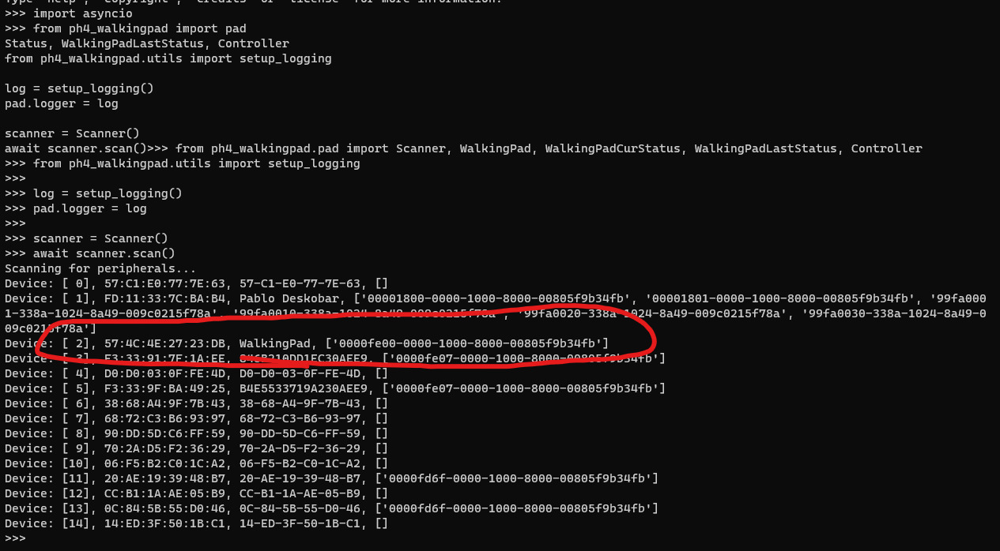

# WalkingPad REST Api

This application is connecting to the KingSmith WalkingPad via the [ph4-walkingpad controller](https://github.com/ph4r05/ph4-walkingpad). It was tested with the WalkingPad A1 but might work with other versions too.

Currently you can switch the modes of the pad (to Standby or Manual) and collect the data from the last session. The data includes the steps, time (in seconds) and distance (in km).
There is also a method to store the latest status read in a database. This was tested with a postgres database and the data is stored in a table with 4 columns:
- The current date (YYYY-MM-dd)
- Steps
- Distance
- Time

This can be used then as a source for visualizing, for example in a Grafana Dashboard.

The REST API can easily be extended, for more details on actions that can be done check the [ph4-walkingpad controller](https://github.com/ph4r05/ph4-walkingpad) repo.

## Bring Up DB

```bash
# Up
docker-compose -f .devcontainer/docker-compose.yml up -d db

# Down
docker-compose -f .devcontainer/docker-compose.yml down
```

## Run Server

```bash
python3 -m venv .venv
source .venv/bin/activate
```

Install dependencies:

```bash
pip3 install --no-cache-dir -r requirements.txt
```

Create initial config by renaming the *sample_config.yaml* to *config.yaml*.

Then run the application

```bash
python restserver.py
```

## Connect to WalkingPad

You need bluetooth to connect to the WalkingPad, so make sure to execute the application on a device that supports bluetooth. If you have connected other devices (e.g. your smartphone) with the pad, make sure to disable bluetooth on this phone and restart the WalkingPad - once a device is paired you have to turn it off and on again that it can pair with a new device.

In order to connect to the WalkingPad you need to know the MacAddress of it. To figure this out just run the *scan.py* script. This will scan for nearby devices. You should see a device named "WalkingPad":



The connection settings are read from a config file. Rename the existing *sample_config.yaml* to *config.yaml* and change the *address* to the Mac Address you just read.

## Testing Connection

Once you've added the proper mac address you can test out whether it works.
Execute a `POST` request to *http://<ServerIP>:5678/mode?new_mode=manual* - this should change the pad from Standby to Manual mode. To switch it back to standby, run *http://<ServerIP>:5678/mode?new_mode=standby*.

If the status is changing on your WalkingPad you're good to go.

# Acknowledgements

Thank you goes to all of the following people, who contributed feedback, bug reports, code submissions, testing, reviews or any kind of input.
  
  - [Peter Wynands](https://peter-wynands.medium.com/1000-km-behind-my-desk-87ab44b4067c) for sharing his blog post about the WalkingPad
  - [@pedropombeiro](https://github.com/pedropombeiro) for extending the functionality of the API
